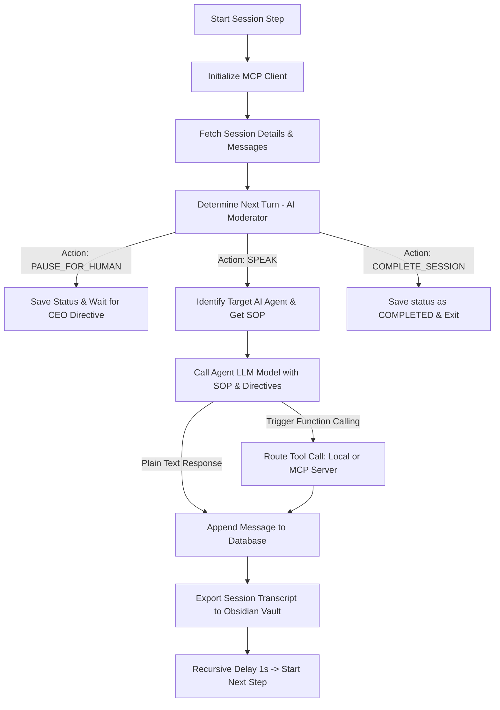

# API & Runtime Rapat Koordinasi Multi-Agen

Siklus rapat koordinasi AI Agent di AgentFlow dikelola oleh motor runtime utama di backend Next.js ([runtime.ts](file:///C:/Users/L15%20RYZEN/Desktop/agentflow/src/lib/agents/runtime.ts)).

## 🔄 Siklus Loop Eksekusi (Hierarchical Router)

Setiap kali rapat koordinasi berjalan (`executeSessionStep`), sistem mengeksekusi langkah-langkah berikut secara berurutan:

## 👑 Intervensi Direktif Executive CEO
Jika Moderator AI mendeteksi butuh persetujuan manusia (misal: pengeluaran kas bernilai nominal sensitif), status rapat akan diubah menjadi `PAUSED_FOR_HUMAN`.
*   Pengguna (Aziz) mengirimkan masukan melalui form input.
*   Pesan disimpan ke dalam database dengan bendera pengirim `HUMAN` / `OWNER`.
*   Saat rapat dilanjutkan, pesan ini ditarik sebagai **Direktif Executive CEO Aktif** dan disuntikkan secara keras (*hard injection*) ke dalam System Instruction agen berikutnya:
    `⚠️ DIREKTIF EXECUTIVE CEO AKTIF: "[Directives]" - Anda wajib memprioritaskan penyelesaian direktif ini sebelum melanjutkan!`

---
*Kembali ke [[00-Developer-Hub]]*
