# 🏆 MASTER FRAMEWORK ARCHITECTURE 5.0: 32-AGENT TRIAD SWARM & OBSIDIAN SECOND BRAIN
## AGENTFLOW B2B AUTOMATED BROKERAGE ENGINE
## Versi: 5.0.0 | Status: APPROVED MULTI-AGENT ENTERPRISE SPECIFICATION

---

## 📌 1. VISI & ARSITEKTUR UTAMA (32-AGENT TRIAD SWARM)

Framework AgentFlow B2B bukan lagi bot kaku sederhana, melainkan sebuah **Sistem Otonom Berhierarki (32 Agent Nodes)** dengan **Obsidian Knowledge Vault Sync**:

* **8 Main Agents (Agen Utama):** Memiliki tanggung jawab spesifik dalam ekosistem makelar B2B.
* **24 Triad Sub-Agents (Agen Pendamping & Pengawas):** Setiap Main Agent dikawal secara eksklusif oleh 3 Sub-Agent Pendamping:
  1. `Sub-Agent Analyzer`: Menganalisis konteks dan data sebelum Main Agent bertindak.
  2. `Sub-Agent Validator`: Melakukan validasi keselamatan (hukum, finansial, format) & *Strict Approval Gate* (Veto/Approve).
  3. `Sub-Agent Memory`: Mengakses & meng-update memori di Obsidian Vault serta melatih kecerdasan Main Agent secara terus-menerus (*Reinforcement Learning*).

---

## 🏛️ 2. PETA HIERARKI 8 MAIN AGENT & 24 TRIAD SUB-AGENT

```mermaid
graph TD
    User([AZIZ - Owner]) <--> MainChat[8. Interactive Co-Pilot Chat Agent]
    
    subgraph ORCHESTRATOR_TEAM ["1. Orchestrator Team"]
        M1[Main Orchestrator Agent]
        M1 --- S1A[Sub-Agent Analyzer]
        M1 --- S1V[Sub-Agent Validator]
        M1 --- S1M[Sub-Agent Memory]
    end

    subgraph SCRAPER_TEAM ["2. Deep Scraper Team"]
        M2[Main Deep Scraper Agent]
        M2 --- S2A[Sub-Agent Analyzer]
        M2 --- S2V[Sub-Agent Validator]
        M2 --- S2M[Sub-Agent Memory]
    end

    subgraph ANALYZER_TEAM ["3. Market & Data Analyzer Team"]
        M3[Main Market Analyzer Agent]
        M3 --- S3A[Sub-Agent Analyzer]
        M3 --- S3V[Sub-Agent Validator]
        M3 --- S3M[Sub-Agent Memory]
    end

    subgraph VALIDATOR_TEAM ["4. Risk & Pricing Validator Team"]
        M4[Main Risk/Pricing Validator Agent]
        M4 --- S4A[Sub-Agent Analyzer]
        M4 --- S4V[Sub-Agent Validator]
        M4 --- S4M[Sub-Agent Memory]
    end

    subgraph COMM_TEAM ["5. Negotiator & Comm Team"]
        M5[Main Negotiator & Comm Agent]
        M5 --- S5A[Sub-Agent Analyzer]
        M5 --- S5V[Sub-Agent Validator]
        M5 --- S5M[Sub-Agent Memory]
    end

    subgraph LEARNING_TEAM ["6. Shared Memory & Learning Team"]
        M6[Main Learning Agent]
        M6 --- S6A[Sub-Agent Analyzer]
        M6 --- S6V[Sub-Agent Validator]
        M6 --- S6M[Sub-Agent Memory]
    end

    subgraph TAXLEGAL_TEAM ["7. Tax & Legal Team"]
        M7[Main Tax & Legal Agent]
        M7 --- S7A[Sub-Agent Analyzer]
        M7 --- S7V[Sub-Agent Validator]
        M7 --- S7M[Sub-Agent Memory]
    end

    subgraph CHAT_TEAM ["8. Interactive Co-Pilot Team"]
        M8[Main Co-Pilot Chat Agent]
        M8 --- S8A[Sub-Agent Analyzer]
        M8 --- S8V[Sub-Agent Validator]
        M8 --- S8M[Sub-Agent Memory]
    end

    Vault[("OBSIDIAN KNOWLEDGE VAULT\n.obsidian/vault/\n(Markdown Knowledge Graph)")]
    
    S1M <--> Vault
    S2M <--> Vault
    S3M <--> Vault
    S4M <--> Vault
    S5M <--> Vault
    S6M <--> Vault
    S7M <--> Vault
    S8M <--> Vault
```



---

## 🔒 3. MEKANISME EKSEKUSI STRICT APPROVAL GATE & REINFORCEMENT LEARNING

Setiap kali Main Agent hendak mengambil tindakan (misal: mengirim email penawaran, memperluas wilayah, atau menambah produk), alur kerja **Strict Approval Gate** berikut dijalankan:

```
[1. Main Agent Menyusun Draf Tindakan]
                  │
                  ▼
[2. Sub-Agent Analyzer Membedah Konteks & Data]
                  │
                  ▼
[3. Sub-Agent Validator Melakukan Check Finansial/Hukum/Risiko]
                  ├──► (Jika Berisiko) ──► VETO / REJECT ──► Log ke Memory ──► Main Agent Re-Draft
                  │
                  └──► (Jika Safe) ──► APPROVE ──► Action Executed
                                           │
                                           ▼
[4. Sub-Agent Memory Mencatat Log ke Obsidian Vault]
                                           │
                                           ▼
[5. Machine Learning Loop: Main Agent Makin Pintar Setiap Iterasi]
```

---

## 📂 4. STRUKTUR OBSIDIAN KNOWLEDGE VAULT (`.obsidian/vault/`)

Seluruh ingatan AI disimpan dalam format Markdown terstruktur di folder `.obsidian/vault/` agar dapat dibuka & divisualisasikan secara langsung melalui aplikasi Obsidian oleh Anda:

```
.obsidian/vault/
├── 01-Factories-Buyer/       # Catatan Profil Pabrik Pembeli [[PT_Nikomas_Gemilang.md]]
├── 02-Suppliers-HPP/         # Database HPP Supplier [[PT_Polychem_Kemasan.md]]
├── 03-Products-Catalog/      # Katalog Barang Industri Auto-Discovered [[Stretch_Film_500mm.md]]
├── 04-Lessons-Learned/       # Catatan Evaluasi Penolakan & Reinforcement [[Learning_2026_08_04.md]]
├── 05-Legal-Tax-Rules/       # Aturan Pajak Perorangan & Legalitas [[Klausul_DP50_SeaBank.md]]
└── 06-Agent-Logs/            # Jejak Audit Eksekusi 32 Agen Nodes [[Log_Orchestrator_2026.md]]
```

---

## 📈 5. STRATEGI EXPANSION CONTINUOUS 70/30 (24/7 NON-STOP)

* **70% Capacity (Home-Turf Dominance - Banten):**
  * Dialokasikan secara kontinu 24 jam non-stop untuk menyisir, mendominasi, dan mengunci seluruh pabrik di Kawasan Industri Banten (Cikande, Nikomas, Cilegon, Serang).
* **30% Capacity (Autonomous Continuous Expansion):**
  * Dialokasikan secara bersamaan 24 jam non-stop untuk memperluas jangkauan ke Jabodetabek $\rightarrow$ Jawa $\rightarrow$ Seluruh Indonesia.
  * Setiap kali barang industri baru ditemukan saat eksplorasi, **Sub-Agent Analyzer & Validator** secara otomatis mendaftarkan item tersebut ke Sourcing Matrix (HPP + Margin 8%) tanpa perlu input manual (5 $\rightarrow$ 50 $\rightarrow$ 100+ items).

---

## 💳 6. PARAMETER KEUNANGAN & IDENTITAS RESMI
* **Model Keuangan:** Modal Rp 0 ter-cover 100% oleh DP 50% dari Pembeli.
* **Margin Keuntungan:** 8% (Broker Murah High Volume).
* **Bank Penampung Resmi:** **SeaBank**
* **No. Rekening:** `901916089038`
* **Atas Nama:** **AZIZ**

---
