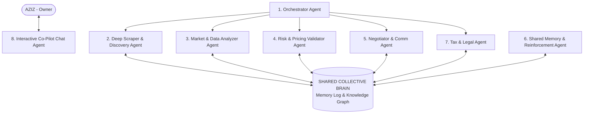

# 🤖 MASTER FRAMEWORK ARCHITECTURE: 8-AGENT AUTONOMOUS SWARM & SHARED BRAIN
## AGENTFLOW B2B AUTOMATED BROKERAGE ENGINE
## Versi: 4.0.0 | Status: APPROVED MULTI-AGENT SPECIFICATION

---

## 📌 1. VISI & PHILOSOPHY ARSITEKTUR
* **Bukan Bot Kaku (Hardcoded):** Framework ini didesain sebagai ekosistem **Multi-Agent Otonom** yang terus berkembang, belajar dari kesalahan, dan memperluas jangkauan wilayah & katalog produk secara mandiri.
* **Shared Collective Brain:** Seluruh 8 Agen Spesialis berbagi satu memori kolektif (*Shared Long-Context Memory & Knowledge Graph*) sehingga pengetahuan satu agen langsung dipahami oleh agen lainnya.
* **Modal Rp 0 & Margin 8%:** Tetap memegang teguh prinsip keamanan finansial 100% ter-cover oleh DP 50% pembeli atas nama **AZIZ (Perorangan)** dengan rekening **SeaBank 901916089038**.

---

## 🏛️ 2. ANATOMI 8 AGEN SPESIALIS (AUTONOMOUS SWARM TEAM)



### 📋 Peran & Tanggung Jawab Spesifik 8 Agen:

1. **Orchestrator Agent (Koordinator Utama):**
   * Mengatur jadwal *event loop*, mengarahkan lalu lintas tugas antar agen, dan memastikan tidak ada tugas yang *deadlock*.
2. **Deep Scraper & Discovery Agent (Penyisir Data Multi-Touch):**
   * Menyisir Google Maps, website resmi perusahaan, dan pola kontak pengadaan secara multi-touch.
   * Bertanggung jawab atas perluasan wilayah otonom (Serang $\rightarrow$ Jabodetabek $\rightarrow$ Indonesia).
3. **Market & Data Analyzer Agent (Penilai Sinyal Pasar & Barang):**
   * Mengumpulkan kebutuhan barang industri pabrik, memperkirakan HPP modal supplier, dan mendaftarkan barang baru ke *Sourcing Matrix* secara otomatis.
4. **Risk & Pricing Validator Agent (Pengawal Margin & DP 50%):**
   * Memvalidasi persentase margin 8%, mengunci kelayakan DP 50% agar modal HPP 100% ter-cover sebelum transaksi berjalan.
5. **Negotiator & Communications Agent (Pengirim Penawaran Otomatis):**
   * Meracik draf penawaran PDF resmi atas nama AZIZ (SeaBank) dan mengirimkannya via Resend Email API ke kontak *Purchasing* pabrik.
6. **Shared Memory & Reinforcement Agent (Mesin Belajar & Evaluasi Errors):**
   * Menganalisis alasan penolakan/diabaikannya penawaran, mengekstrak *lesson-learned*, dan meng-update bobot kecerdasan di *Shared Memory*.
7. **Tax & Legal Agent (Pengawal Hukum & Pajak Broker Perorangan):**
   * Memastikan klausa penawaran bebas sengketa hukum, menyesuaikan regulasi pajak makelar perorangan (PPh 21/23), dan menjaga legalitas transaksi.
8. **Interactive Co-Pilot Chat Agent (Partner Diskusi Real-Time AZIZ):**
   * Menjadi asisten interaktif di dashboard yang siap menjawab pertanyaan mendalam dari Anda mengenai status transaksi, strategi agen, hingga detail arsitektur teknis.

---

## 📈 3. STRATEGI EXPANSION OTONOM (70/30 EXPLORATION-EXPLOITATION)

* **70% Exploitation Resource:**
  * Diaplikasikan pada wilayah yang sudah terbukti menghasilkan (*Established Zones* seperti Cikande/Cilegon) dan barang industri utama yang terbukti tinggi pemesanan.
* **30% Autonomous Exploration Resource:**
  * AI mengalokasikan 30% daya jelajahnya secara otonom untuk mencoba wilayah kawasan industri baru (Tangerang, Karawang, Bekasi, Pasuruan, Medan) dan mengekstrak barang industri baru.
* **Auto-Cataloging:**
  * Setiap kali barang industri baru ditemukan oleh Discovery Agent saat eksplorasi, item tersebut **otomatis didaftarkan** ke Sourcing Matrix (HPP + Margin 8%) tanpa perlu input manual dari manusia (5 $\rightarrow$ 50 $\rightarrow$ 100+ item).

---

## 🔄 4. ADAPTIVE REINFORCEMENT LEARNING LOOP (CARA AI MAKIN PINTAR)

```
[Penawaran Diterbitkan] 
       │
       ├──► (Respon Positif / PO Received) ──► Shared Memory +Weight (+1.0) ──► Pola Ditiru & Diperluas
       │
       └──► (Penolakan / Diabaikan >3 Hari) ──► Learning Agent Run Root-Cause Analysis:
                                                   ├── Parameter Margin Terlalu Tinggi? ──► Adjust Margin
                                                   ├── Timing Email Kurang Tepat? ──► Shift Schedule
                                                   └── Kontak Purchasing Salah? ──► Trigger Scraper Enrichment
```

---

## 💾 5. IMPLEMENTASI DATABASE & SHARED MEMORY

Tabel utama di Prisma Schema yang mengabadikan ingatan bersama seluruh 8 Agen:
* `AgentMemoryLog`: Menyimpan entitas, tipe ingatan, *lessons learned*, dan bobot kecerdasan.
* `KnowledgeGraphItem`: Tempat penyimpanan barang industri yang ditemukan mandiri oleh AI.
* `BrokerDeal`: Rekam jejak seluruh penawaran & status pencairan DP 50%.

---
